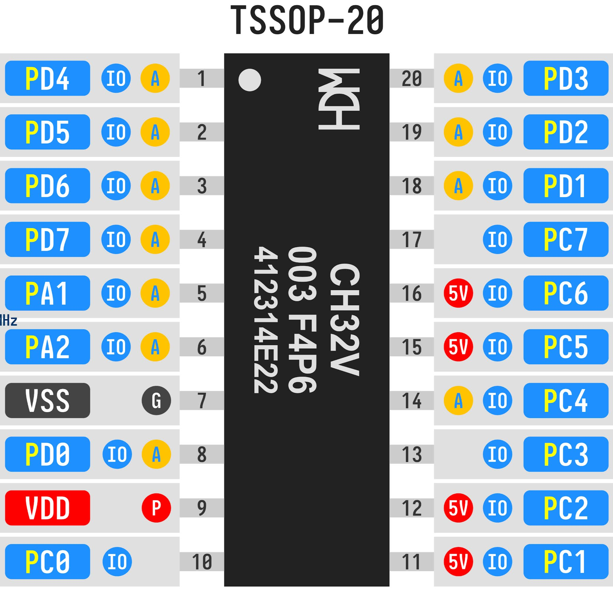
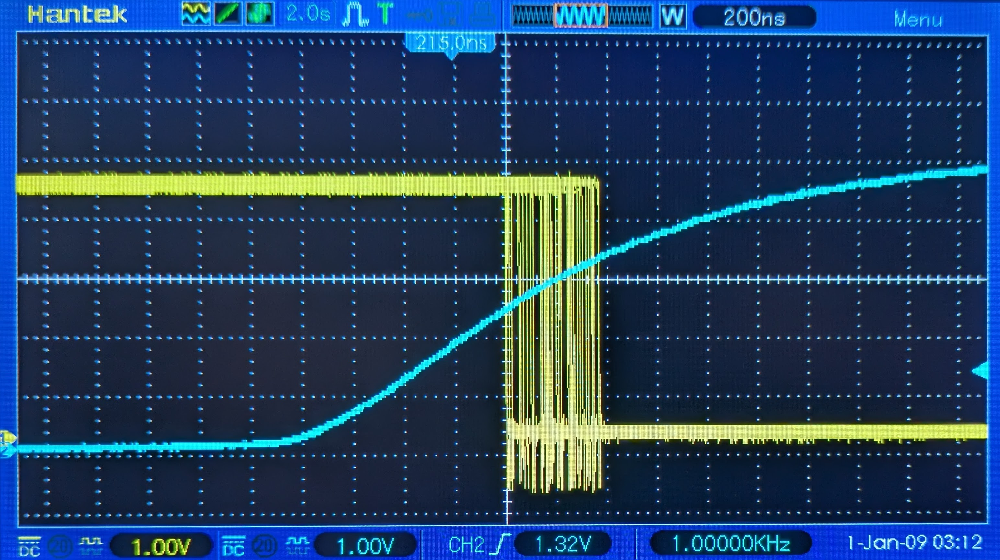

# cherepanov

> The $0.1 PLD you already have in your drawer.

Turn a CH32V003 microcontroller into a tiny reprogrammable glue chip. Write
low-density logic in Verilog or SystemVerilog, feed the source through
`bin/cli.js`, and get a runtime-free C firmware that bit-bangs GPIO to
emulate the circuit -- slower than a real PLD, but cheap and flexible.

## How it works

```
 top.v / top.sv  ──►  Verilator (--cc)  ──►  lowered logic body  ──►  cli.js  ──►  main.c
                         (C++ logic)          (transcribed to C)        (GPIO bridge)
                                                                                  │
                                                                                  ▼
                                                                          riscv64-elf-gcc
                                                                                  │
                                                                                  ▼
                                                                            main.bin  ──►  CH32V003
```

`bin/cli.js <config.js>` is the only entry point. It:

1. Runs Verilator `--cc` to lower the Verilog/SystemVerilog into C++.
2. Extracts the lowered logic body (`___ico_sequent__TOP__0`).
3. Translates that body to plain C (no verilated runtime -- it's hosted-only
   and won't build for the bare-metal `rv32ec` target).
4. Wraps it in a GPIO bridge: reads input pins via `GPIOx->INDR`, evaluates,
   writes output pins via `GPIOx->OUTDR`.
5. Generates `funconfig.h` and `Makefile`, builds the firmware, and runs a
   timing analysis on the disassembly.

## Requirements

* Verilator v5
* [ch32fun](https://github.com/cnlohr/ch32fun) (CH32V003 toolchain + bootloader)
* RISC-V bare-metal toolchain (`riscv64-elf-gcc`)
* Node.js (for `bin/cli.js`)

## Quick start

```
cd examples/74x04
../../bin/cli.js config.js
make flash
```

## Config file

The config file (`.js` or `.json`) is the only argument and fully describes
the build:

```js
module.exports = {
  top:    'top',                   // optional; default = stem of vsrc[0]
  vsrc:   ['top.sv'],              // Verilog/SystemVerilog source files
  // include: ['../common.vh'],    // optional; Verilog include files
  clock:  { mhz: 48, use_pll: true }, // optional; default 48 MHz PLL
  // ch32fun: '../ch32fun/ch32fun',   // optional; path to ch32fun (default: $CH32FUN or ../ch32fun/ch32fun)
  ports: {                         // explicit per-port -> physical pin map
    a: { type: 'input',  width: 6, pins: ['d0','d1','d2','d3','d4','d5'] },
    y: { type: 'output', width: 6, pins: ['c0','c1','c2','c3','d2','d3'] },
  }
};
```

Each pin string (e.g. `'d4'`) maps to a physical GPIO pin (`PD4`). A Verilog
port of arbitrary width maps to an arbitrary list of pins, which may span
several GPIO ports; the generator reads each touched GPIO port's `INDR` once
and writes one `OUTDR` word per touched output port.

Non-output pins are configured as floating inputs (no pull-up/down), which
disables their output driver. This makes a blind full-port `GPIOx->OUTDR`
write safe: output pins get driven, input pins' latch bits update but are
not driven externally.

## Examples

| example | function | source | flash |
|---------|----------|--------|-------|
| `7400` | quad 2-input NAND | `top.v` | 852 B |
| `74x02` | quad 2-input NOR | `top.v` | 828 B |
| `74x04` | hex inverter (6 gates) | `top.sv` | 748 B |

Each example directory has a `config.js`, a Verilog source, and (after
running `cli.js`) a generated `main.c` + `funconfig.h` + `Makefile`.

## CH32V003 pinout



## Benchmark: 74x04 inverter

Oscillogram of one gate of the 74x04 inverter. Blue line is the input, yellow
line is the output. With change-detection the loop polls at the fast-path rate
while inputs are idle and runs the slow path only on the iteration that detects
an edge; the input→output delay is `Tslow + Tfast/2` with `±Tfast/2` aperture
jitter (see below).



### Timing model

The loop has two execution paths because of change-detection:

- **fast path** -- no input changed: read each input GPIO port's `INDR`,
  compare against the saved previous value, `continue` back to the top. Skips
  eval + `OUTDR` writes. Cost is one `INDR` read + compare per input port, so
  it is estimated from the number of input GPIO ports (P):
  `Tfast ≈ (3·P + 1)/f + P·0.05 µs`. The idle poll loop's one branch is always
  taken the same way (no mispredict bubble, no +1.6), and it only does `INDR`
  reads, which are cheaper than `OUTDR` writes (~0.05 µs each).
- **slow path** -- some input changed: read `INDR`, detect the change, run
  `eval`, write `OUTDR`, loop back. `Tslow = (instrs + 1.6)/f + mmio·0.1 µs` is
  counted from the full loop body in `main.lst` (the +1.6 is the taken
  back-edge bubble; OUTDR writes pay the full AHB→APB bridge floor).

While inputs are idle, *every* iteration runs the fast path, so the loop polls
at `1/Tfast`. An input edge arriving at a random phase waits for the next
`INDR` read (uniform in `[0, Tfast]`, mean `Tfast/2`), then the detecting
slow-path iteration spends its read→write span `Tslow` to drive `OUTDR`. This
is exactly a clocked-FF + combinational-logic timing model:

```
Tdelay  = Tslow + Tfast/2     (mean input→output delay)
Tjitter = ±Tfast/2            (aperture jitter — the only variable term)
```

The jitter is entirely **sampling (aperture) jitter** -- not interrupt latency
-- and the only lever on it is shortening the fast path (the poll rate). With
change-detection off, `Tfast = Tslow = T` and this reduces to the
oscilloscope-validated `Tdelay = 1.5T`, `Tjitter = ±0.5T`.

### Where the time goes

Two oscilloscope data points pin the slow-path model (`Tslow = (instrs+1.6)/f +
mmio·0.1 µs`):

| clock | Tslow (measured) | Tslow (model) |
|-------|------------------|---------------|
| 48 MHz (PLL) | 0.4 µs | 0.40 µs |
| 24 MHz (HSI) | 0.6 µs | 0.60 µs |

Solving: `c = 9.6` cycles, `m = 0.2 µs` (2 MMIO). The fast path
(`Tfast = instrs/f + mmio·0.05 µs`, no branch bubble, cheaper INDR reads) is
pinned by the 74x04 jitter measurement: 3 input ports → `Tfast = 0.36 µs` →
`Tjitter = ±0.18 µs`. At 48 MHz the slow path is **50% CPU-bound, 50%
MMIO-bound** -- the clock is only a half-lever because the AHB→APB bridge sets
a floor the PLL can't touch; the fast path (and thus the jitter) is dominated
by the `INDR` read cost, so the clock is only a weak lever on jitter -- the
real lever is reading fewer input ports.

For low-density logic the gate eval itself (`~a`, `~(a & b)`, etc.) is a
handful of ALU instructions and is **not** the bottleneck. The dominant cost
is **port remuxing** -- scattering input bits across GPIO ports and gathering
output bits back. With a linear mapping (all inputs on one port, all outputs
on another, identity bit order) the compiler folds the scatter/gather into
two mask instructions and the loop hits the 0.4 µs floor. Pin mappings that
span multiple GPIO ports cost ~3×.

`cli.js` reports the timing analysis automatically after building:

```
Timing analysis
----------------
  clock:        48 MHz (PLL)
  fast path:    10 instrs, 3 INDR reads  -> Tfast = 0.36 us
  slow path:    58 instrs +1.6 = 59.6 cyc, 7 MMIO  -> Tslow = 1.94 us
  Tdelay:       2.12 us   (Tslow + Tfast/2)
  Tjitter:      +-0.18 us   (Tfast/2 aperture)
```

### openSUSE Tumbleweed

```
sudo zypper install verilator cross-riscv64-elf-gcc16 cross-riscv64-newlib-devel \
                    cross-riscv64-binutils libudev-devel libusb-1_0-devel nodejs
```

## License

See [LICENSE](LICENSE).
